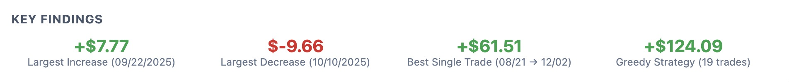
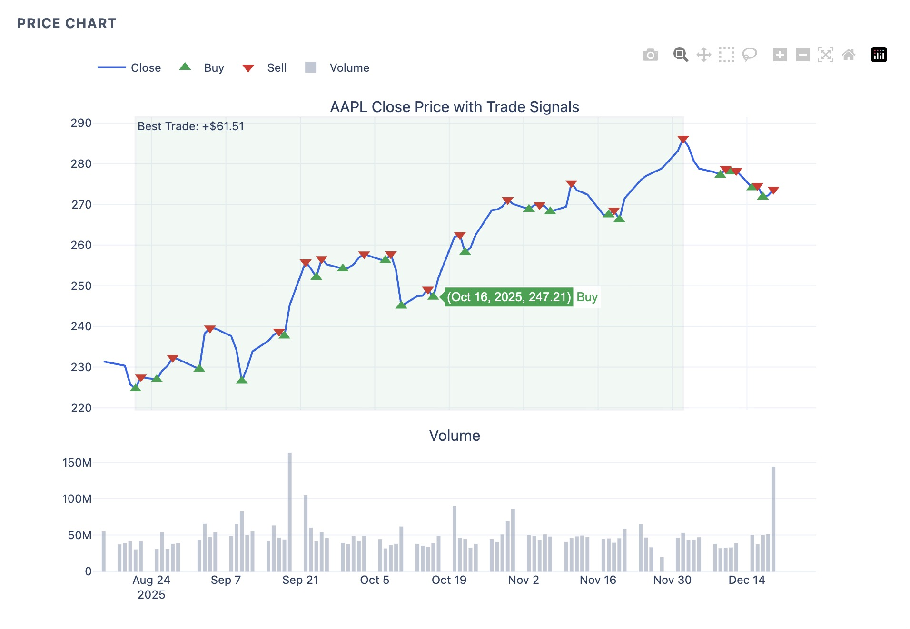
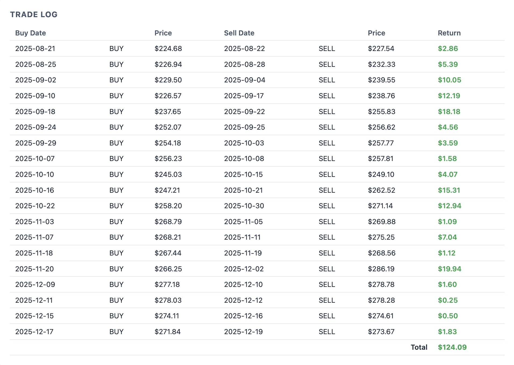

# AAPL Stock Analysis Pipeline

**Data Engineer Technical Assessment**

## Overview

My submission for the Data Engineer assessment. I wanted to keep things simple and readable while showing how I think about this stuff in a production context -- clean code, well-commented SQL, and straightforward algorithms for the bonus questions instead of over-engineered abstractions.

The pipeline ingests AAPL stock data, loads it into SQLite, answers all the assessment questions (including both bonus problems), and generates a lightweight interactive HTML report as a value-add for downstream review.

## Report Preview





*Generated by running `python pipeline.py` -- open `output/report.html` locally for the full interactive version.*

## Project Structure

```
├── pipeline.py                # Ingest, analyze, orchestrate
├── generate_report.py         # HTML report (separated from pipeline logic)
├── analysis.sql               # DDL, idempotent load, all queries
├── data/
│   └── aapl_stock_prices.csv
├── output/
│   └── report.html            # Generated after running pipeline
├── Dockerfile
├── docker-compose.yml
└── requirements.txt
```

## How to Run

**Locally:**
```bash
pip install -r requirements.txt
python pipeline.py
```

**With Docker (optional):**
```bash
docker-compose up --build
```
I included Docker not because the exercise requires it, but because environment consistency matters regardless of the problem size.

**SQL queries standalone:**
```bash
sqlite3 data/aapl.db < analysis.sql
```
The `analysis.sql` file can also be pasted into [SQLite Online](https://sqliteonline.com/) after importing the `aapl_stock_prices.csv` CSV.

Screenshots of the examples with results:
Q1:

Q2:

BQ1:

BQ2:


## Approach

**Q1 & Q2:** Compute `Close - Open` per day, sort.

**Bonus Q1 (Best single trade):** Running-minimum approach -- walk the data tracking the lowest close seen so far, check if selling at today's close beats our best profit. O(n), no nested loops.

**Bonus Q2 (Greedy daily trading):** Look one day ahead -- if tomorrow's price is higher, be holding; if it's lower, don't be. Buy/sell on state transitions. All positions close.

**Idempotent design:** SQLite load uses `INSERT OR REPLACE` keyed on the date PK. Running the pipeline twice produces the same result -- no duplicates, no errors.

**Data quality & profiling:** I noted in the code where I'd add programmatic DQ checks and performance profiling in a production pipeline. For a dataset this size I validated manually, but at scale those would gate the pipeline and alert on failure.

## Tools Used

I used **Claude Code** as a pair-programming tool throughout this project. My workflow was: I designed the approach, then used Claude to accelerate implementation for the HTML report scaffolding and the formatting/structure of this README, which are the kinds of things where an LLM saves real time without compromising quality. The analytical logic and architecture decisions are mine; Claude helped me get there faster.

Other references: [Plotly docs](https://plotly.com/python/), [SQLite docs](https://www.sqlite.org/docs.html), [pandas API](https://pandas.pydata.org/docs/reference/).

## Stack Alignment

Intentionally aligned with the stack used where it made sense:
- **Python + SQL** as core tools
- **SQLite** as lightweight stand-in for Snowflake (same SQL patterns)
- **Docker** for environment consistency (mirrors container-based deployments)
- Idempotent patterns that translate to dbt incremental models or Prefect task retries
